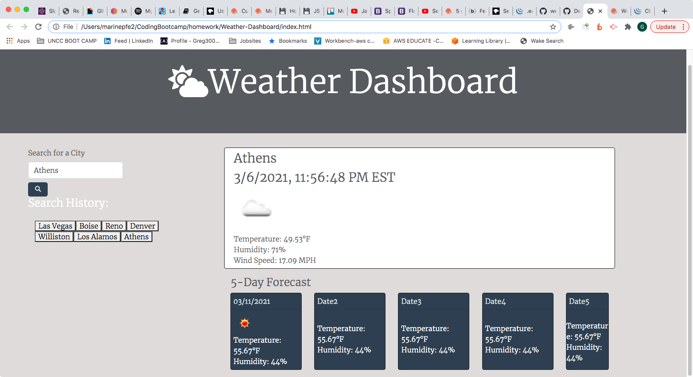

# Weather-Dashboard
# 06 Server-Side APIs: Weather Dashboard

[Deployed Link](https://gregpetropoulos.github.io/Weather-Dashboard/)

## User Story

```
AS A traveler
I WANT to see the weather outlook for multiple cities
SO THAT I can plan a trip accordingly
```

## Acceptance Criteria


- [x] A weather dashboard with form inputs for a search of any city
- [x] Presented with current and future conditions for that city and that city is added to the search history
- [x] When I view current weather conditions for that city I am presented with the city name, the date, an icon representation of weather conditions, the temperature, the humidity, the wind speed,
- [] When I view the UV index, I am presented with a color that indicates whether the conditions are favorable, moderate, or severe
- [x] When I view future weather conditions for that city I am presented with a 5-day forecast that displays the date, an icon representation of weather conditions, the temperature, and the humidity
- [x] I click on a city in the search history, I am again presented with current and future conditions for that city


## Mock-Up

The following image shows the web application's appearance and functionality:



[Deployed Link](https://devil0341.github.io/Weather-Dashboard/)